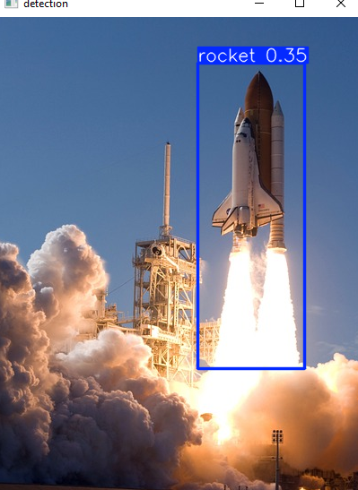

# Rocket Detection (Computer Vision Project)

## Description
Object detection system developed with YOLO techniques
Build an AI/ML Rocket detection system with YOLO

## Output

## Features
- Uses YOLO to train Model.
- Trains on  dataset to detect rockets.

## Files Structure
- 'Training_model.ipynb'       : Code to train the model.
- 'rocket_detection_image.py'  : Code to detect safety helmet on image 
- 'rocket_detection_vidieo.py' : Code to detect safety helmet on vidieo 
- 'dataset'                    : Folder of dataset
- 'images'                     : Folder of images
- 'vidieo'                     : Folder of vidieo
- 'models'                     : Folder of models
